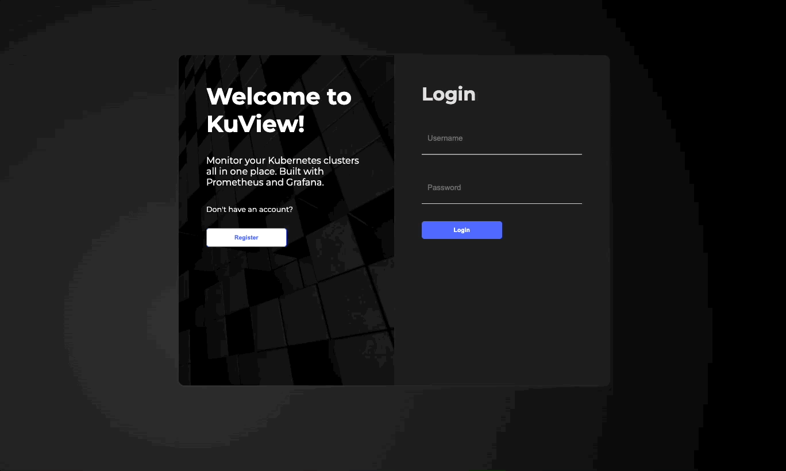
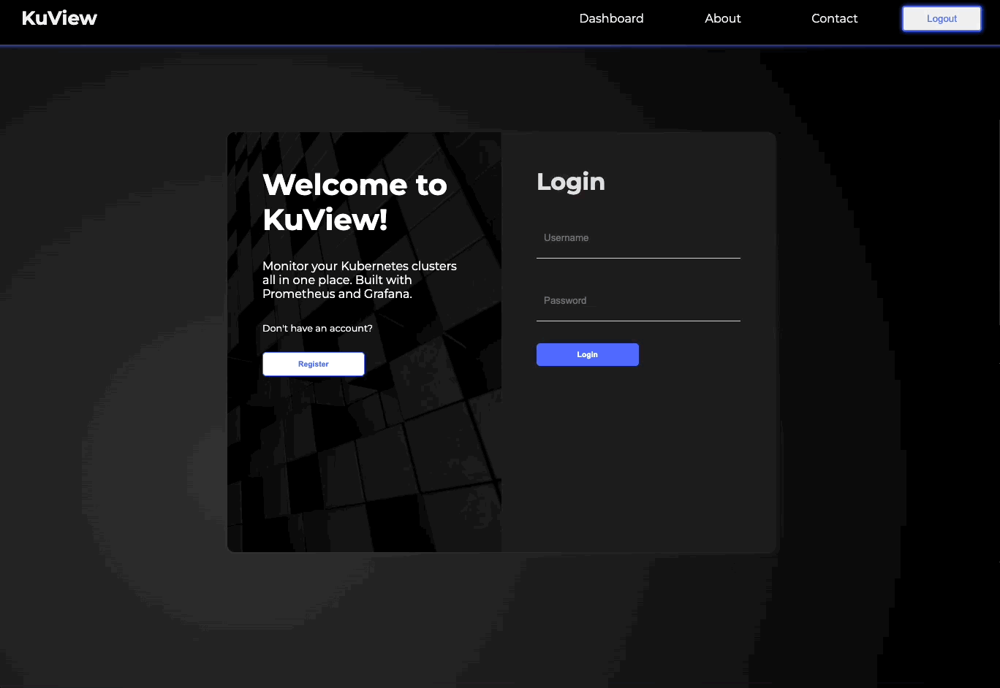
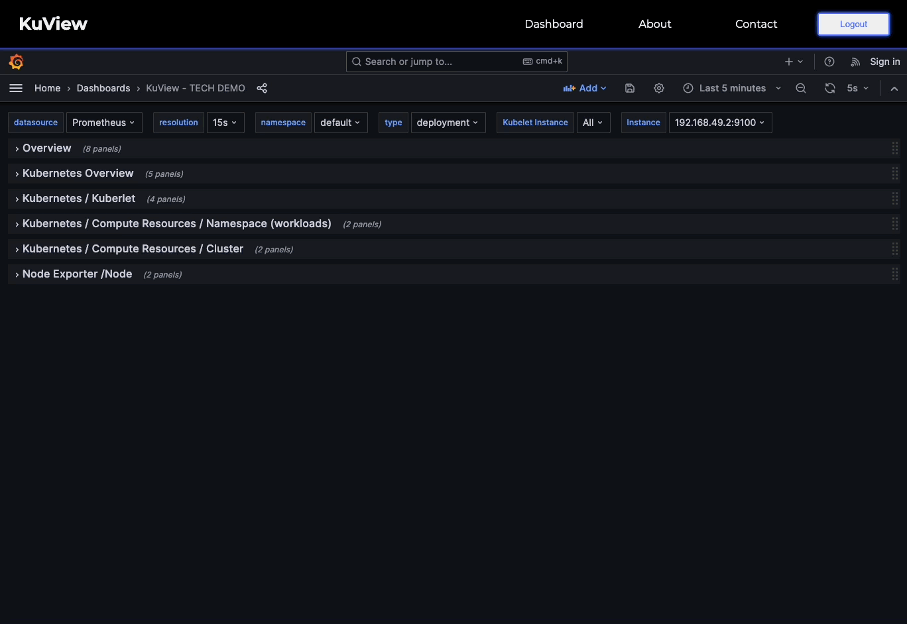

<div align='center'>

---

## Tech Stacks


<div align='center'>

• [Introduction](#introduction) • [Prerequisites](#prerequisites) • [Getting started](#getting-started) • [Installation](#installation) • [Considerations](#considerations) • [Open Source](#open-source) • [Meet The Team](#meet-the-team) •

</div>
</div>

## Introduction

KuView is an open-source tool for simplified Kubernetes metric visualization. It offers a customizable, interactive dashboard to track and monitor local Kubernetes clusters with real-time metrics in a user-friendly UI.

## Prerequisites

This application requires you to have Docker, Minikube, and Kubectl installed in order to view your local kubernetes cluster. Please download based on your operating system from the official website or Github releases.

- Docker Desktop: [https://www.docker.com/products/docker-desktop/](https://www.docker.com/products/docker-desktop/)
- Minikube: [https://minikube.sigs.k8s.io/docs/start/](https://minikube.sigs.k8s.io/docs/start/)
- Kubectl: [https://kubernetes.io/docs/tasks/tools/](https://kubernetes.io/docs/tasks/tools/)

After these are installed, start Minikube with Docker:

- Open a terminal or command prompt and run `minikube start --driver=docker`. This will start the local Minikube cluster using Docker as the driver.
- To verify the status of your Minikube cluster, run `minikube status`.
- To interact with your minikube cluster, use the kubectl command line interface tools
- To stop and delete your Minikube cluster, you can run the commands `minikube stop` and `minikube delete`.

## Getting Started

To get started with opening the web application, first clonse this repo onto your machine. In order to have the application work, you will need to create an .env file to store your mongo-URI and a port for the express server to run on. Within your .env file please type the following:

```js
MONGO_URI = '<mongodb URI>';
PORT = 4000;
```

Once that file is created, open the terminal and install all the packages with

```bash
npm install
```

then type in

```bash
npm run dev
```

On your browser, localhost:8080 should appear, and you are now running our application!

If this is your first time using the application, you will need to register an account. If you have already have an account, proceed with logging in.



_Once you type in your username, password, and email, the application will direct you to login._

## Installation

After typing in your credentials and logging in, our application will automatically handle the installation of Prometheus and Grafana on your Kubernetes cluster through helm and apply our custom .yaml files.

**We would highly recommend installing [HomeBrew](https://brew.sh/) manually before using KuView** to avoid possible installation issues.



The dashboard will be saved onto your account and be displayed afterwards.



You can now view your cluster metrics in real-time, and the dashboard will update automatically. Feel free to personalize the dashboard and rearrange the layout to your preference!

## Considerations

**As kuView is still early in it's development stage, There are a few things to keep in mind when using this application.**

### Port

KuView requires a number of defult ports to operate. Please **avoid** using the ports listed below.

For more information, execute the following command in your terminal `kubectl get services` after login for the first time.
| Port | Application |
|:---:|:-------------------|
| **8080** | Kuview Dashboard |
| **4000** | Express |
| **9090** | Prometheus |
| **3000** | Grafana |

### Accounts

Currently we are having issue loading the dashboard for any subsequent user, this is duo to a conflict in grafana. Upon a new user login, KuView's attempt to create a new Grafana dashboard with the same name as a previously created one. for a smooth experience, please only use **one** account for the time being.

If you need to create and use a new account, before login please follow the steps listed below:

- Execute the following command in your terminal `kubectl port-forward service/prometheus-grafana 3000:80`
- Once on the dashboard, go to the "Dashboard" section and locate the "General" folder.
- Within the "General" folder, delete the KuView dashboard to prevent any conflicts.

## Contributions

If you would like to contribute and make KuView a better Open Source Porject,we welcome you with open arms.

Below lists a table of features we currently have and future plans.

<div style="display: flex; ">

|        Feature         | Status |
| :--------------------: | :----: |
| Automate installation  |   🎉   |
|  Grafana yaml config   |   🎉   |
|    Custom dashboard    |   🎉   |
|   Password ecryption   |   🎉   |
| Jest Front-end Testing |   🎉   |
| Jest Back-end Testing  |   ⏳   |
| Typescript conversion  |   ⏳   |
|      Alert System      |   🙌   |
| Node health Visualizer |   🙌   |
|   Cluster Visualizer   |   🙌   |

<div style="display: flex; margin-left: 30px; margin-top: 25px ">

- 🎉 = **Completed!**
- ⏳ = **In Development!**
- 🙌 = **Open for Contribution!**

</div>
</div>

## Creators

|       Creators        |                                                                                                                           GitHub                                                                                                                            |                                                                                                                                   LinedIn                                                                                                                                   |
| :-------------------: | :---------------------------------------------------------------------------------------------------------------------------------------------------------------------------------------------------------------------------------------------------------: | :-------------------------------------------------------------------------------------------------------------------------------------------------------------------------------------------------------------------------------------------------------------------------: |
| **Cameron Kirksey** | <a href="https://github.com/CameronKirksey21" target="blank"></a> |    <a href="https://www.linkedin.com/in/cameronkirksey/" target="blank"></a>    |
|   **Eric Esposito**   |   <a href="https://github.com/Ericesposito" target="blank"></a>   |  <a href="https://www.linkedin.com/in/eric-andre-esposito" target="blank"></a>  |
|    **Eric Rennie**    |   <a href="https://github.com/ericmrennie" target="blank"></a>    |     <a href="https://www.linkedin.com/in/ericmrennie/" target="blank"></a>      |
|    **Jason Yeung**    |    <a href="https://github.com/JasonY000" target="blank"></a>     | <a href="https://www.linkedin.com/in/jason-yeung-yat-shun/" target="blank"></a> |
|    **Richard Dao**    |    <a href="https://github.com/daorichard" target="blank"></a>    |         <a href="https://www.linkedin.com/in/rdao" target="blank"></a>          |
